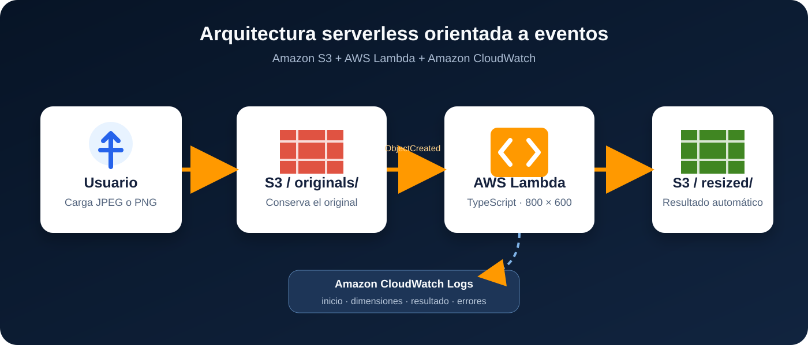

# Procesamiento de imágenes con arquitectura serverless

Solución orientada a eventos que conserva una imagen original en Amazon S3, ejecuta automáticamente una función AWS Lambda escrita en TypeScript y guarda una copia redimensionada en el mismo bucket.



## Flujo implementado

1. El usuario carga un archivo JPEG o PNG en `originals/`.
2. S3 emite `s3:ObjectCreated:*` únicamente para ese prefijo.
3. Lambda obtiene el objeto, lo redimensiona y conserva su tipo de contenido.
4. El resultado se guarda como `resized/<nombre>-800x600.<extensión>`.
5. CloudWatch registra la configuración, claves, dimensiones y tamaños procesados.

La clave de salida es determinista y sus metadatos conservan el ETag del origen. Si S3 entrega dos veces el mismo evento, la función detecta que ya existe un resultado equivalente. El filtro `originals/` evita que un objeto escrito en `resized/` vuelva a disparar la Lambda.

## Configuración

| Variable | Predeterminado | Descripción |
|---|---:|---|
| `OUTPUT_WIDTH` | `800` | Ancho final, entre 1 y 4096 px |
| `OUTPUT_HEIGHT` | `600` | Alto final, entre 1 y 4096 px |
| `INPUT_PREFIX` | `originals/` | Área de entrada |
| `OUTPUT_PREFIX` | `resized/` | Área de resultados |

## Desarrollo local

Requiere Node.js 20 o superior.

```bash
npm install
npm run verify
```

`npm run verify` ejecuta comprobación de tipos, pruebas automatizadas, crea `dist/lambda.zip`, genera una imagen de muestra de 1600 × 1200 y prepara `dist/cloudshell-deploy.zip`.

## Despliegue en AWS CloudShell

1. Seleccionar la región `us-east-2`.
2. Clonar el repositorio público y construir el paquete dentro de CloudShell.
3. Ejecutar:

```bash
git clone https://github.com/greyesf1-ops/procesamiento-imagenes-serverless.git
cd procesamiento-imagenes-serverless
npm install
npm run verify
chmod +x scripts/deploy-aws.sh
LAMBDA_ZIP=dist/lambda.zip \
SAMPLE_IMAGE=samples/paisaje-demo-original.jpg \
./scripts/deploy-aws.sh
```

El script crea un bucket privado, cifrado y versionado; un rol IAM limitado a leer `originals/`, escribir/consultar `resized/` y registrar logs; la función Lambda; el permiso de invocación; y la notificación de S3 filtrada por prefijo. Finalmente carga la muestra para comprobar el flujo de extremo a extremo.

## Seguridad y observabilidad

- Bloqueo completo de acceso público en S3.
- Cifrado SSE-S3 y versionado habilitados.
- El código no incluye claves, tokens ni cadenas de conexión.
- El rol no puede eliminar objetos ni escribir en `originals/`.
- Logs estructurados JSON en `/aws/lambda/procesar-imagenes-typescript` con retención de 14 días.
- Memoria de 512 MB y tiempo máximo de 30 segundos.

## Prueba esperada

| Objeto | Dimensiones | Conservación |
|---|---:|---|
| `originals/paisaje-demo-original.jpg` | 1600 × 1200 | Permanece intacto |
| `resized/paisaje-demo-original-800x600.jpg` | 800 × 600 | Creado automáticamente |

## Estructura

```text
src/index.ts                 Función Lambda completa
tests/index.test.ts          Pruebas de configuración y claves
scripts/deploy-aws.sh        Despliegue reproducible con AWS CLI
scripts/create-sample.ts     Generador de la imagen de demostración
template.yaml                Definición equivalente con AWS SAM
docs/arquitectura.svg        Diagrama de la arquitectura
```

## Costos y limpieza

La práctica utiliza servicios de pago por uso. Para evitar costos posteriores, elimine los objetos y recursos de la práctica desde la cuenta de AWS cuando ya no necesite conservar la evidencia.
